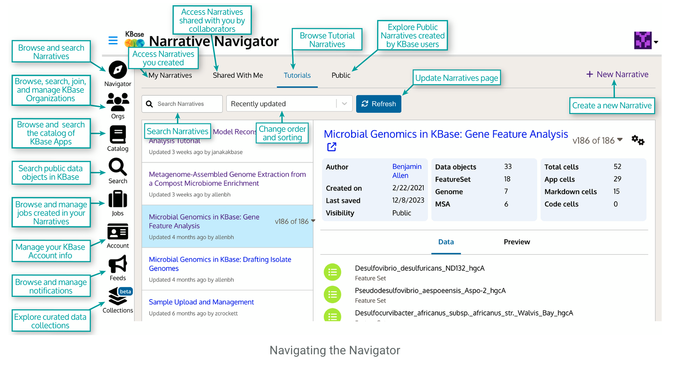
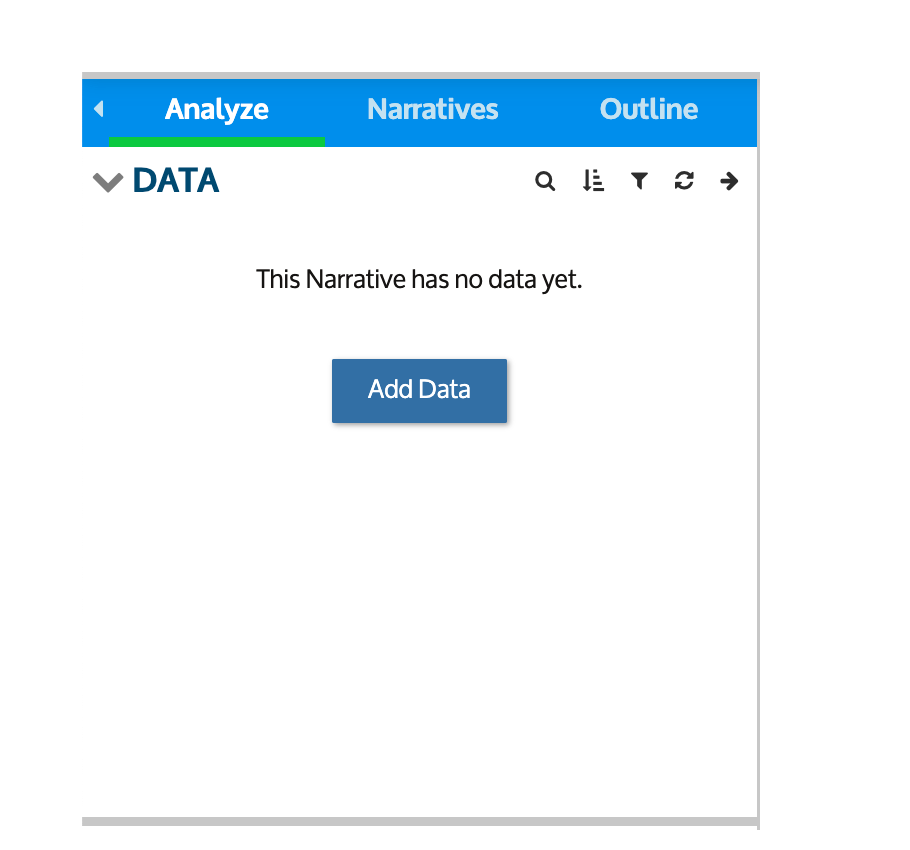
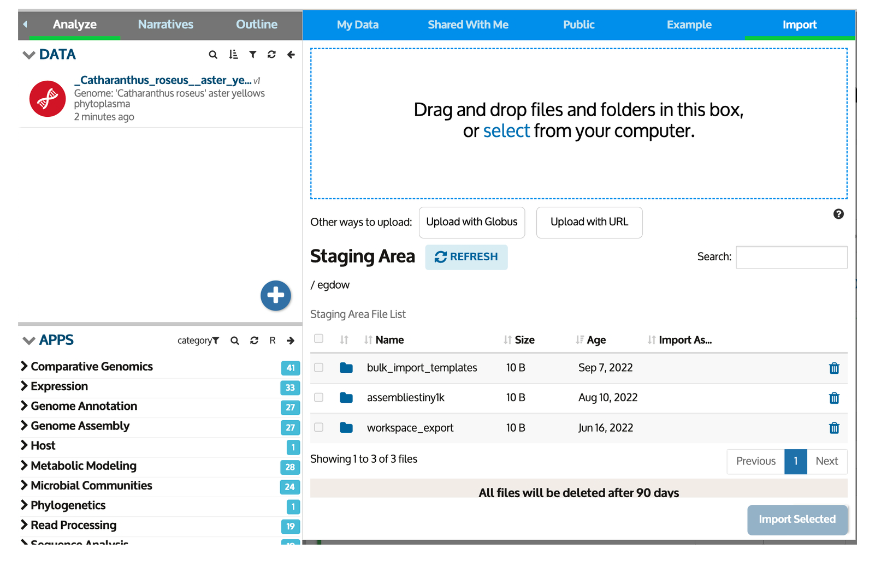
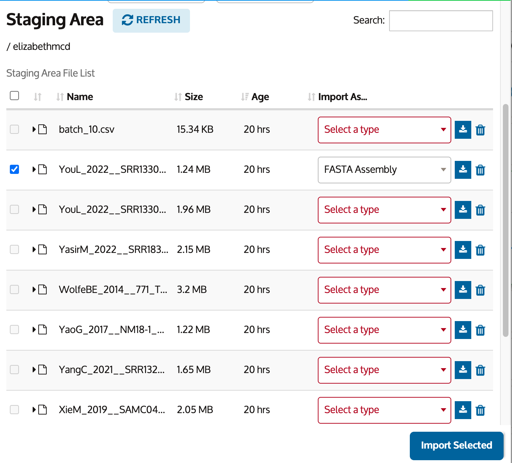
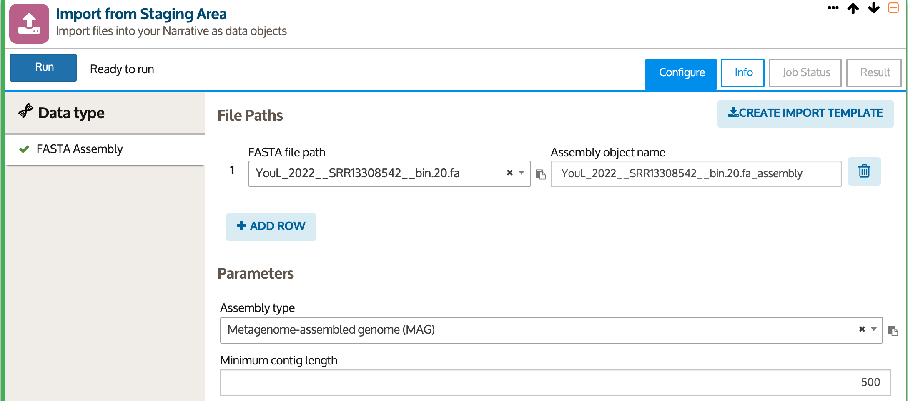
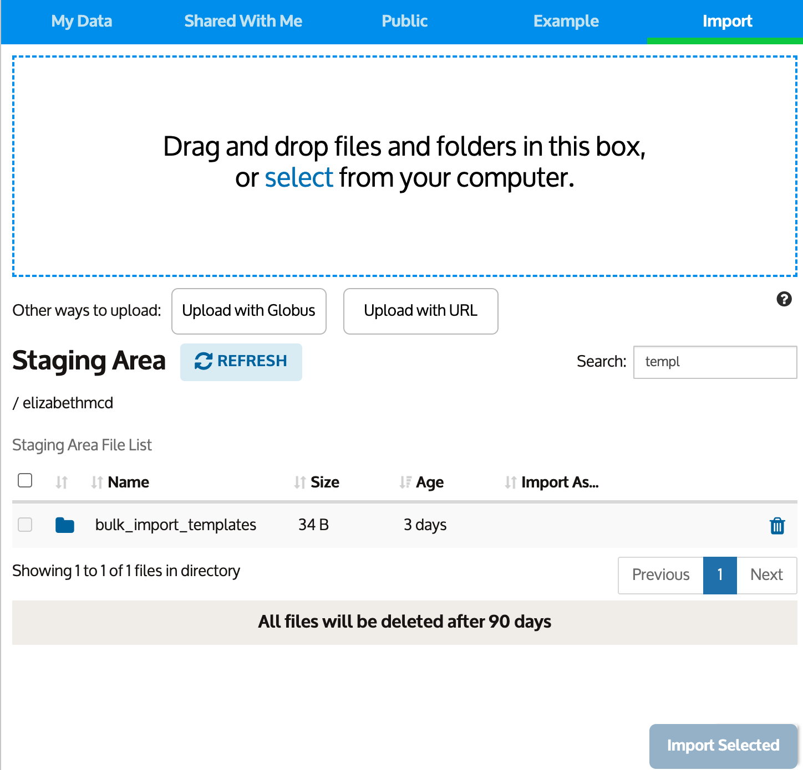
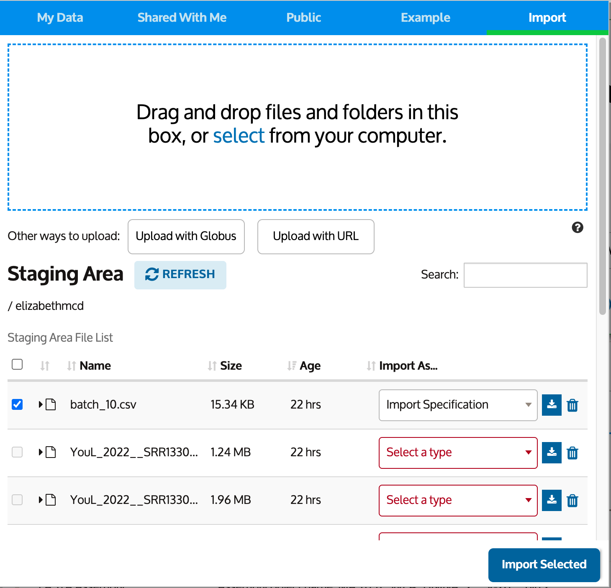
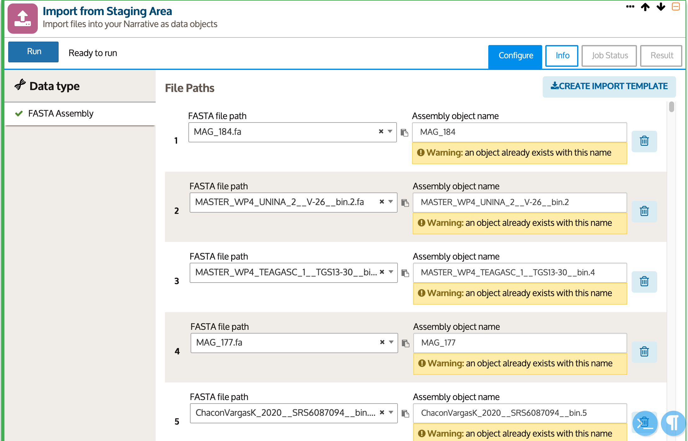

# Uploading Genomes and Sample Set Information to KBase

This document describes setting up a KBase narrative with a set of curated genomes and metadata for downstream users to explore and analyze. You can sign-up for a KBase account [here](https://narrative.kbase.us/legacy/signup) with any email account. You are not required to be affiliated with an academic institution or government organization to use KBase, and you can reside outside of the United States. You can find KBase documentation [here](https://docs.kbase.us/).

## About KBase
[KBase](https://www.kbase.us/) is a community-driven platform for facilitating open science research in systems biology. KBase allows you to run bioinformatics tools on large datasets using freely available Department of Energy high-perofrmance computing resources, allowing for open-sharing of research outputs and collaborative work. 

We have deposited our set of ~4000 "strain-representative" (clustered at 99% average nucleotide identity) genomes into KBase. This document describes how that process was done, and how users can also use these steps to create their own custom narratives containing either their own genomes, subsets of the strain-representative collection, or additional genomes from our database that are available on [Zenodo](TODO).

This documentation follows the bulk import KBase documentation [here](https://docs.kbase.us/data/upload-download-guide/uploads) with added steps for implementing a python script to help facilitate uploading genomes in batches.

## Create a Narrative
The main working unit on KBase is the narrative. A narrative is where you can create shareable, reproducible workflows containing certaint tools chained together, analyses and results, and/or datasets. 

To create a narrative, click on the `+ New Narrative` button in the top-right corner of the KBase interface. 


## Create the Bulk Import Template for your Batches
If you have a large set of genomes to upload (say about more than 1000), it is recommended to prepare them in batches. Since we had ~4000 genomes to upload, we split them into batches of around 500 genomes each. 

If you don't need to create the bulk import template (as in you can just use the python script out of the box) skip to the next step.

First to show how the bulk import works, you can upload a single genome to KBase. On the left-hand top pane of KBase, click `Add Data`. Then on the pop-out click `Import`. 

<div style="display: flex; gap: 10px;">
  
  
</div>


You can either upload data from a URL, Globus, or from your local computer. In our case, we uploaded FASTA files for genome assemblies from a local computer. Then select the import type as "FASTA Assembly". Then make sure to select that file and click "Import". 


Once you click import, a popout will appear in your narrative called `Import from Staging Area`. This will show the file(s) you selected from the staging area. If you choose to prep your batches of genomes using the python script below, you should only have to do this next step once. 

Fill out the two fields selecting the options that match your genome assembly. For our purposes, we are either uploading metagenome-assembled genomes (MAGs) or isolate genomes. For this example we selected metagenome-assembled genomes, and a minimum contig length of 500 bp. For our purposes we just selected a minimum contig length of 500 bp for every input assembly, but if you want to programatically enter this information that's entirely possible to implement with our python script documented below. 


Then click `CREATE IMPORT TEMPLATE` at the top right of the module. Then go back to "My Data" and your staging area. This template file will be in a folder called `bulk_import_templates`. Open the folder, and download the file. If the file doesn't automatically appear click "Refresh" a couple of times. 



Your bulk template CSV is going to look like this: 
```
Data type: assembly; Columns: 4; Version: 1			
staging_file_subdir_path	type	min_contig_length	assembly_name
FASTA file path	Assembly type	Minimum contig length	Assembly object name
YouL_2022__SRR13308542__bin.20.fa	Metagenome	500	YouL_2022__SRR13308542__bin.20
```

The python script below handles both setting up batches of genome files for upload and creating template specification import files that adhere to this structure.


## Prepare Batches of Genomes
The python script in `../scripts/batch_fasta_files` handles both programatically creating batches of genomes into subdirectories from a single input directory of genomes and creating input specification template files that correspond to those batches. 
```
usage: batch_fasta_files.py [-h] [--batch-size BATCH_SIZE]
                            [--output-dir OUTPUT_DIR]
                            [--samplesheet-dir SAMPLESHEET_DIR]
                            input_dir
batch_fasta_files.py: error: the following arguments are required: input_dir
```

For example, we used this script to split our input directory of ~4000 "strain-resolved" genomes into batches of 500 using this script. **Note that we configured this script so that assembly files starting with GCA/GCF are designated as "Draft isolates" and all other assembly files are designated as Metagenome-assembled genomes".** This might not be the case for your input files, so adjust the script as needed. 

We created the batches launching the script as follows: 
```
python3 scripts/batch_fasta_files.py 99id_genomes --batch-size 500 --output-dir 99id_batches --samplesheet-dir 99id_batch_samplesheets
```

In general it's probably not recommended to upload more than 500 at at time, but I'm not sure if this is a recommendation or hard and fast requirement. 

## Upload Genomes to KBase 
Now you are ready to upload each batch of genomes to KBase. When you navigate back to the "Data" pane and upload from your computer, select the first folder containing your batch of genomes. To select all files on a Mac press Cmnd + A. Then click Upload. **Do not refresh the page, the upload will be interrupted.**

Once all the genomes are uploaded, then upload the corresponding bulk template CSV. The script names the folders and the CSV files the same, such as `batch_1/` folder of genomes and `batch_1.csv` for the corresponding template CSV. Upload the CSV. 

If the batch CSV doesn't appear automatically, refresh the data in the staging area or refresh the Narrative (only if all your files have finished uploading to the staging area!!). 

Select the import CSV and select the file type as "Import Specification" and click "Import Selected". **Only import the CSV specification file, not any of the genomes!!**



A popout module "Import from Staging Area" will appear. Now all of your FASTA files in that batch appear without you having to manually click them all and import! (Note that the below shows files that have already been uploaded and shows a warning for this). If everything looks good, click "Run"


Now you will have to do this process for however many batches you have (in our case around 10). As your data uploads, it will start to appear in the left-hand side "Data" panel. 

## Upload Sample Set Information to KBase 

The associated metadata will have to be modified slightly to upload to KBase as a Sample Set. The script `sctipts/modify-metadata.py` handles making these small modifications, namely changing the first column to be "name" and changing long lists of sample or run accessions to lists of ranges if the samples/runs are lists that are in sequential order. Upload this to KBase in the same fashion as the genomes in the staging area, and set the file type to "Sample Set". 

## Add Documentation to the Narrative

## Create a Narrative with Subsets of Genomes